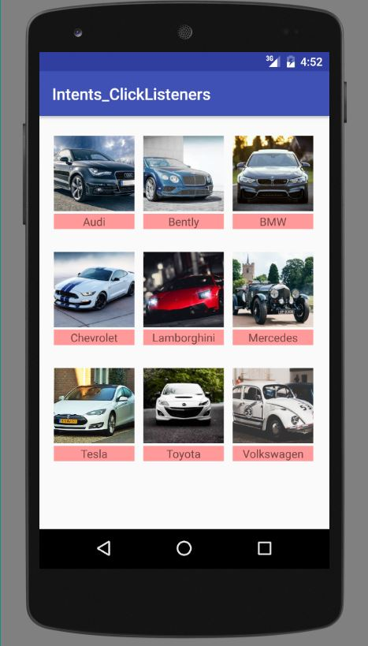
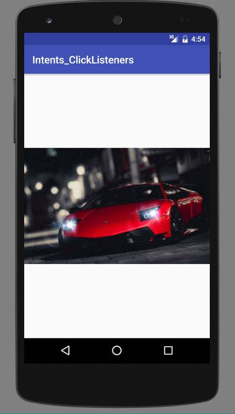
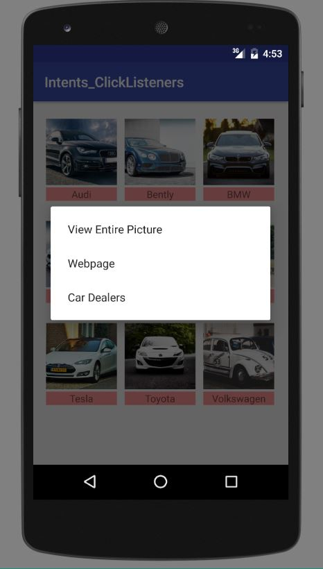

This program illustrates the concept of implicit and explicit intents. It also showcases using single click and long click listeners. Clicking on bigger image opens up browser or long click selection created an implicit intent call to browser.

<h3 align="center">Preview of Program</h3>

	
	
	

